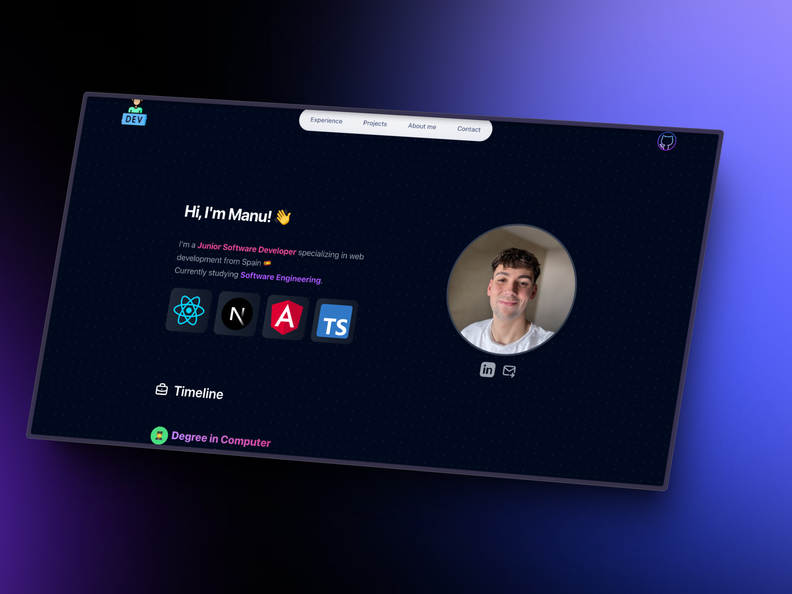

# Portfolio

Welcome to my portfolio! Here you can explore my projects and skills in web development.



## Technologies Used

- **Astro**: A modern static site generator that makes it easy to build fast websites.
- **React**: A JavaScript library for building efficient user interfaces.
- **HTML**: For content structure.
- **CSS**: For design and presentation.


## Installation and Usage

If you want to run this project locally, follow these steps:

1. Clone the repository:

   ```bash
   git clone https://github.com/manurgz10/portfolio.git

2. Navigate to the project directory:
   ```bash
   cd portfolio

3. Install the dependencies:
   ```bash
   npm install
  
4. Run the project:
   ```bash
   npm run dev


